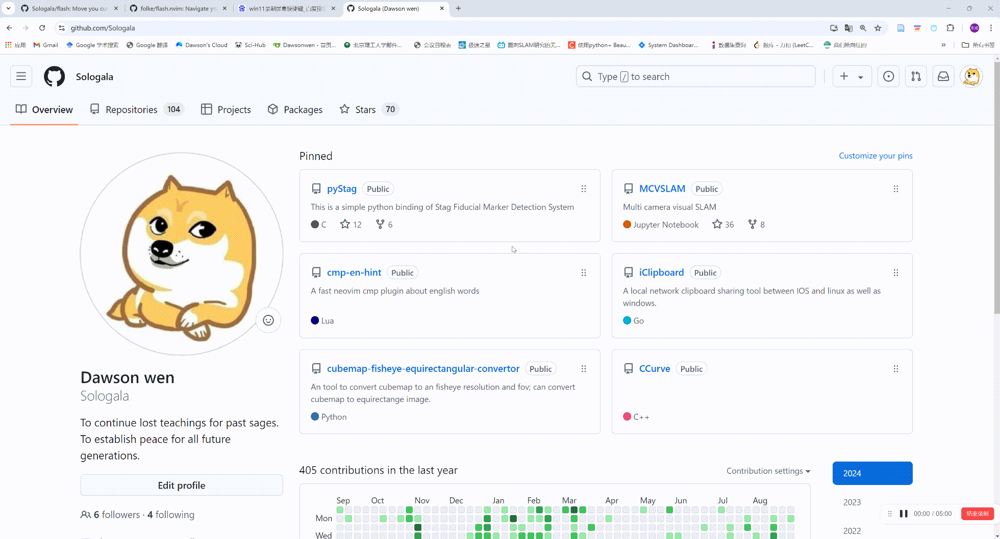

# ⚡Flash

Flash provides the ability to use the keyboard to control the mouse to click anywhere on the screen, by treating the screen as a 3x3 grid and assigning it to 9 buttons, recursively selecting the area you want to click.

# Usage

Press `WIN` + `CTRL` + `G`, screen will be overlayed and splitted to 9 area. Then, Press `U I O` , `J K L` , `M < >`， will selecte relative area.

Press `CTRL` will perform `DOUBLE_CLICK`
Press `SHIFT` will perform `RIGHT_CLICK`

